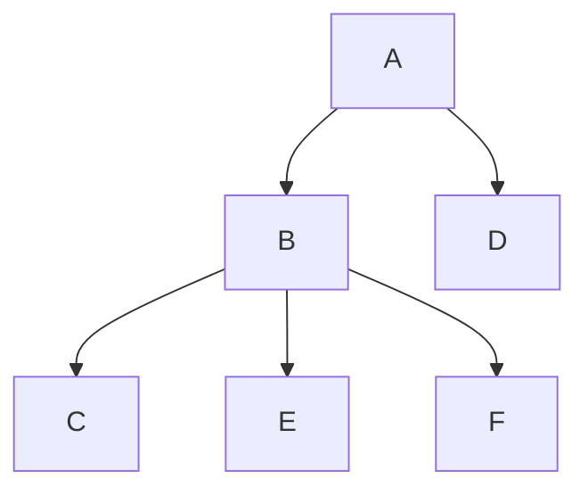

# Zookeeper

## 一.  Zookeeper简介

### 1.  Zookeeper诞生历史

《从 paxos 到 zookeeper》  雅虎的整个分布式系统

- 无单点问题的分布式协调框架，精力集中再处理业务逻辑
- 内部很多项目都是使用动物的名字来命名
- 大型动物管理员

### 2.  为什么需要Zookeeper

- HashMap
- 不可靠
- 高可用，数据一致

官网 [Apache ZooKeeper](https://zookeeper.apache.org/)

Apache ZooKeeper is an effort to develop and maintain an open-source server which enables highly reliable distributed coordination.

- 分布式应用程序的分布式协调服务
- 不因为某一个节点宕机而不可用

### 3.  5 大特点

- 顺序一致性
- 原子性
- 单一系统映像
- 可靠性
- 及时性

### 4.  架构图


### 5.  作用

分布式锁

配置中心

## 二.  Zookeeper的安装与配置

### 1.  Linux下的安装

CentOS 7.6

地址随着版本升级，会发生变化，最新地址从浏览器访问https://downloads.apache.org/zookeeper，然后找到对应版本的下载地址。

以3.6.3版本为例：

```shell
wget https://downloads.apache.org/zookeeper/zookeeper-3.6.3/apache-zookeeper-3.6.3-bin.tar.gz
tar zxvf apache-zookeeper-3.6.3-bin.tar.gz
cd apache-zookeeper-3.6.3-bin
cp conf/zoo_sample.cfg conf/zoo.cfg
```

#### 启动

```shell
./bin/zkServer.sh start
```

#### 停止

```shell
./bin/zkServer.sh stop
```

### 2.  Windows下的安装

下载zookeeper

网址https://zookeeper.apache.org/releases.html

下载3.6.x

解压后运行zkServer.cmd ，初次运行可能会报错，因为没有zoo.cfg配置文件

将conf下的zoo_sample.cfg复制一份改名为zoo.cfg即可。

配置文件含义：

dataDir=./数据存储的目录

clientPort=2181 zookeeper的端口号

修改完成后启动zookeeper，运行zkServer.cmd

### 3.  Mac下的安装

zookeeper支持brew安装。

```shell
brew info zookeeper
# 安装

$brew install zookeeper
启动服务：执行命令zkServer

$zkServer 
JMX enabled by default
Using config: /usr/local/etc/zookeeper/zoo.cfg
Usage: ./zkServer.sh {start|start-foreground|stop|restart|status|upgrade|print-cmd}

$ zkServer status
JMX enabled by default
Using config: /usr/local/etc/zookeeper/zoo.cfg
Error contacting service. It is probably not running.
$ zkServer start
JMX enabled by default
Using config: /usr/local/etc/zookeeper/zoo.cfg
Starting zookeeper ... STARTED
```

## 三.  Zookeeper的使用

### 1.  节点znode（基本数据模型）

树结构



#### 节点特点

- 可以存储数据结构，但信息尽量简洁
- 树形结构，有父子节点
- 有版本号的概念，可以用来防止误操作
- 可以设定监听器，感知变化

#### 节点类型

- 持久节点
- 临时节点
- 顺序节点
- 可以组合

### 2.  Zookeeper的常用命令

- 节点操作
- 增、删、改、查

```shell
# 先启动，在执行下面连接
./bin/zkCli.sh -server 127.0.0.1:2181
# 出现  [zk: 127.0.0.1:2181(CONNECTED) 0] 
```

help

```shell
ZooKeeper -server host:port -client-configuration properties-file cmd args
	addWatch [-m mode] path # optional mode is one of [PERSISTENT, PERSISTENT_RECURSIVE] - default is PERSISTENT_RECURSIVE
	addauth scheme auth
	close 
	config [-c] [-w] [-s]
	connect host:port
	create [-s] [-e] [-c] [-t ttl] path [data] [acl]
	delete [-v version] path
	deleteall path [-b batch size]
	delquota [-n|-b] path
	get [-s] [-w] path
	getAcl [-s] path
	getAllChildrenNumber path
	getEphemerals path
	history 
	listquota path
	ls [-s] [-w] [-R] path
	printwatches on|off
	quit 
	reconfig [-s] [-v version] [[-file path] | [-members serverID=host:port1:port2;port3[,...]*]] | [-add serverId=host:port1:port2;port3[,...]]* [-remove serverId[,...]*]
	redo cmdno
	removewatches path [-c|-d|-a] [-l]
	set [-s] [-v version] path data
	setAcl [-s] [-v version] [-R] path acl
	setquota -n|-b val path
	stat [-w] path
	sync path
	version 
```

增删改查

```shell
[zk: 127.0.0.1:2181(CONNECTED) 1] ls
ls [-s] [-w] [-R] path
[zk: 127.0.0.1:2181(CONNECTED) 2] ls /
[zookeeper]
[zk: 127.0.0.1:2181(CONNECTED) 3] ls /zookeeper 
[config, quota]
[zk: 127.0.0.1:2181(CONNECTED) 4] create /java1 hellojava1
Created /java1
[zk: 127.0.0.1:2181(CONNECTED) 5] create /java1/zk1 hellozk1
Created /java1/zk1
[zk: 127.0.0.1:2181(CONNECTED) 6] ls java1
Path must start with / character
[zk: 127.0.0.1:2181(CONNECTED) 7] ls /java1
[zk1]
[zk: 127.0.0.1:2181(CONNECTED) 8] get /java1
hellojava1
[zk: 127.0.0.1:2181(CONNECTED) 9] create /java2 hellojava2
Created /java2
[zk: 127.0.0.1:2181(CONNECTED) 10] create /java2/zk2 hellozk2
Created /java2/zk2
[zk: 127.0.0.1:2181(CONNECTED) 11] ls -R /
/
/java1
/java2
/zookeeper
/java1/zk1
/java2/zk2
/zookeeper/config
/zookeeper/quota
[zk: 127.0.0.1:2181(CONNECTED) 12] set /java2/zk2 hellozk3
[zk: 127.0.0.1:2181(CONNECTED) 13] get /java2/zk2
hellozk3
[zk: 127.0.0.1:2181(CONNECTED) 14] delete /java2/zk2
[zk: 127.0.0.1:2181(CONNECTED) 15] delete /java2
[zk: 127.0.0.1:2181(CONNECTED) 16] ls -R /
/
/java1
/zookeeper
/java1/zk1
/zookeeper/config
/zookeeper/quota
```

### 3.  高级命令

版本号

顺序节点

乐观锁删除

```shell
[zk: 127.0.0.1:2181(CONNECTED) 17] stat /java1
cZxid = 0x2
ctime = Wed Nov 02 09:41:20 EDT 2022
mZxid = 0x2
mtime = Wed Nov 02 09:41:20 EDT 2022
pZxid = 0x3
cversion = 1
dataVersion = 0
aclVersion = 0
ephemeralOwner = 0x0
dataLength = 10
numChildren = 1
[zk: 127.0.0.1:2181(CONNECTED) 18] set /java1 rr
[zk: 127.0.0.1:2181(CONNECTED) 19] create /java1/zk2 u
Created /java1/zk2
[zk: 127.0.0.1:2181(CONNECTED) 20] stat /java1
cZxid = 0x2
ctime = Wed Nov 02 09:41:20 EDT 2022
mZxid = 0x9
mtime = Wed Nov 02 09:54:40 EDT 2022
pZxid = 0xa
cversion = 2
dataVersion = 1
aclVersion = 0
ephemeralOwner = 0x0
dataLength = 2
numChildren = 2
[zk: 127.0.0.1:2181(CONNECTED) 21] delete /java1/zk2
[zk: 127.0.0.1:2181(CONNECTED) 22] stat /java1
cZxid = 0x2
ctime = Wed Nov 02 09:41:20 EDT 2022
mZxid = 0x9
mtime = Wed Nov 02 09:54:40 EDT 2022
pZxid = 0xb
cversion = 3
dataVersion = 1
aclVersion = 0
ephemeralOwner = 0x0
dataLength = 2
numChildren = 1
[zk: 127.0.0.1:2181(CONNECTED) 23] create /java3
Created /java3
[zk: 127.0.0.1:2181(CONNECTED) 24] stat /java3
cZxid = 0xc
ctime = Wed Nov 02 09:55:53 EDT 2022
mZxid = 0xc
mtime = Wed Nov 02 09:55:53 EDT 2022
pZxid = 0xc
cversion = 0
dataVersion = 0
aclVersion = 0
ephemeralOwner = 0x0
dataLength = 0
numChildren = 0
[zk: 127.0.0.1:2181(CONNECTED) 25] set /java3 1
[zk: 127.0.0.1:2181(CONNECTED) 26] stat /java3
cZxid = 0xc
ctime = Wed Nov 02 09:55:53 EDT 2022
mZxid = 0xd
mtime = Wed Nov 02 09:56:13 EDT 2022
pZxid = 0xc
cversion = 0
dataVersion = 1
aclVersion = 0
ephemeralOwner = 0x0
dataLength = 1
numChildren = 0
[zk: 127.0.0.1:2181(CONNECTED) 27] set /java3 abc -v1
[zk: 127.0.0.1:2181(CONNECTED) 28] set /java3 abcd -v1
version No is not valid : /java3
[zk: 127.0.0.1:2181(CONNECTED) 29] stat /java3
cZxid = 0xc
ctime = Wed Nov 02 09:55:53 EDT 2022
mZxid = 0xe
mtime = Wed Nov 02 09:56:48 EDT 2022
pZxid = 0xc
cversion = 0
dataVersion = 2
aclVersion = 0
ephemeralOwner = 0x0
dataLength = 3
numChildren = 0
[zk: 127.0.0.1:2181(CONNECTED) 30] create /java4 -e
Created /java4
[zk: 127.0.0.1:2181(CONNECTED) 31] stat /java4
cZxid = 0x10
ctime = Wed Nov 02 09:58:33 EDT 2022
mZxid = 0x10
mtime = Wed Nov 02 09:58:33 EDT 2022
pZxid = 0x10
cversion = 0
dataVersion = 0
aclVersion = 0
ephemeralOwner = 0x100001440ec0000
dataLength = 0
numChildren = 0
[zk: 127.0.0.1:2181(CONNECTED) 32] create /java5
Created /java5
[zk: 127.0.0.1:2181(CONNECTED) 33] create /java5/abc -s
Created /java5/abc0000000000
[zk: 127.0.0.1:2181(CONNECTED) 34] create /java5/abc -s
Created /java5/abc0000000001
[zk: 127.0.0.1:2181(CONNECTED) 35] create /java5/abc -s
Created /java5/abc0000000002
[zk: 127.0.0.1:2181(CONNECTED) 36] create /java5/abc -s
Created /java5/abc0000000003
[zk: 127.0.0.1:2181(CONNECTED) 37] create /java5/abc -s -e
Created /java5/abc0000000004
[zk: 127.0.0.1:2181(CONNECTED) 38] 

```


 

### 4.  Watcher监视器

监视器、触发器、监督者

使用场景：通知，例如配置中心更新数据

#### Watcher事件类型

| EventType           | 触发条件     |
| ------------------- | ------------ |
| NodeCreated         | 节点创建     |
| NodeDelete          | 节点删除     |
| NodeDataChanged     | 节点数据修改 |
| NodeChildrenChanged | 子节点变更   |


### 5.ACL

Access Control List 权限控制列表

CREATE：可以创建子节点

READ：可以从节点获取数据并列出子节点

WRITE：可以为节点设置数据

DEKETE：可以删除子节点

ADMIN：可以设置权限


#### 权限方案

实际用的不多，了解即可

world：任何人

auth：通过验证（zk有权限验证功能）

digest：加密码

ip：ip限定，双刃剑


## 四.  Zookeeper代码实操

zk原生客户端

Apache Curator

