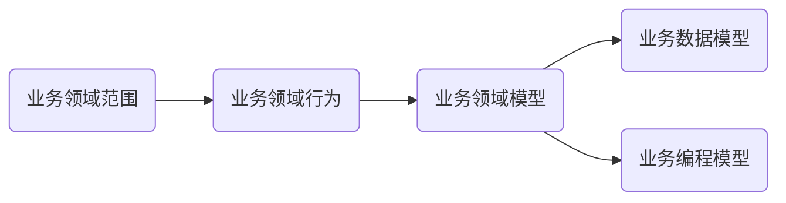
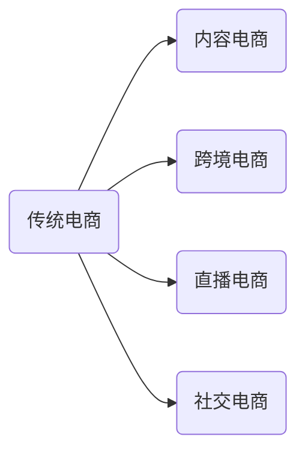

# SpringCloud整合Dubbo3实战高并发微服务架构设计


[TOC]


## 一.  预习-Dubbo技术得回顾

### 1.  RPC服务

#### Ⅰ.  什么叫RPC

> RPC【Remote Procedure Call】是指远程过程调用，是一种进程间通信方式，他是一种技术的思想，而不是规范。它允许程序调用另 一个地址空间（通常是共享网络的另一台机器上）的过程或函数，而不用程序员显式编码这个远程调用的细节。即程序员无论是调用本地的还是远程的函数，本质上编写的调用代码基本相同。
>
> RPC基本原理，RPC两个核心模块：**通讯，序列化**。 


1. 服务消费方（client）调用以本地调用方式调用服务；
2. client stub接收到调用后负责将方法、参数等组装成能够进行网络传输的消息体；
3. client stub找到服务地址，并将消息发送到服务端；
4. server stub收到消息后进行解码；
5. server stub根据解码结果调用本地的服务；
6. 本地服务执行并将结果返回给server stub；
7. server stub将返回结果打包成消息并发送至消费方；
8. client stub接收到消息，并进行解码；
9. 服务消费方得到最终结果。

RPC框架的目标就是要2~8这些步骤都封装起来，这些细节对用户来说是透明的，不可见的

### 2.  Netty通信原理

> **Netty**是一个异步事件驱动的网络应用程序框架，用于快速开发可维护的高性能协议服务器和客户端。它极大地简化并简化了**TCP**和**UDP**套接字服务器等网络编程。

#### Ⅰ.  BIO


#### Ⅱ.  NIO


- Selector     一般称 为选择器 ，也可以翻译为 多路复用器，
- Connect（连接就绪）、Accept（接受就绪）、Read（读就绪）、Write（写就绪）

#### Ⅲ.  Netty基本原理


### 3.  Dubbo

#### Ⅰ.  基本简介

> Apache Dubbo (incubating) 是一款高性能、轻量级的开源Java RPC框架，它提供了三大核心能力：面向接口的远程方法调用，智能容错和负载均衡，以及服务自动注册和发现。官网：[http://dubbo.apache.org/](https://www.oschina.net/action/GoToLink?url=http%3A%2F%2Fdubbo.apache.org%2F)

#### Ⅱ.  框架设计


- config 配置层：对外配置接口，以     ServiceConfig, ReferenceConfig 为中心，可以直接初始化配置类，也可以通过     spring 解析配置生成配置类
- proxy 服务代理层：服务接口透明代理，生成服务的客户端 Stub 和服务器端 Skeleton, 以 ServiceProxy 为中心，扩展接口为 ProxyFactory.
- registry 注册中心层：封装服务地址的注册与发现，以服务 URL 为中心，扩展接口为 RegistryFactory,     Registry, RegistryService
- cluster 路由层：封装多个提供者的路由及负载均衡，并桥接注册中心，以     Invoker 为中心，扩展接口为 Cluster, Directory,     Router, LoadBalance
- monitor 监控层：RPC 调用次数和调用时间监控，以 Statistics 为中心，扩展接口为 MonitorFactory,     Monitor, MonitorService
- protocol 远程调用层：封装 RPC 调用，以 Invocation, Result 为中心，扩展接口为 Protocol, Invoker,     Exporter
- exchange 信息交换层：封装请求响应模式，同步转异步，以 Request, Response 为中心，扩展接口为 Exchanger,     ExchangeChannel, ExchangeClient, ExchangeServer
- transport 网络传输层：抽象 mina 和 netty 为统一接口，以     Message 为中心，扩展接口为 Channel, Transporter,     Client, Server, Codec
- serialize 数据序列化层：可复用的一些工具，扩展接口为 Serialization,     ObjectInput, ObjectOutput, ThreadPool

#### Ⅲ.  启动解析、加载配置信息


#### Ⅳ.  服务暴露


#### Ⅴ.  服务引用


#### Ⅵ.  基本组成


- 服务提供者（Provider）：暴露服务的服务提供方，服务提供者在启动时，向注册中心注册自己提供的服务。
- 服务消费者（Consumer）: 调用远程服务的服务消费方，服务消费者在启动时，向注册中心订阅自己所需的服务，服务消费者，从提供者地址列表中，基于软负载均衡算法，选一台提供者进行调用，如果调用失败，再选另一台调用。
- 注册中心（Registry）：注册中心返回服务提供者地址列表给消费者，如果有变更，注册中心将基于长连接推送变更数据给消费者
- 监控中心（Monitor）：服务消费者和提供者，在内存中累计调用次数和调用时间，定时每分钟发送一次统计数据到监控中心

#### Ⅶ.  调用关系说明

- 服务容器负责启动，加载，运行服务提供者。
- 服务提供者在启动时，向注册中心注册自己提供的服务。
- 服务消费者在启动时，向注册中心订阅自己所需的服务。
- 注册中心返回服务提供者地址列表给消费者，如果有变更，注册中心将基于长连接推送变更数据给消费者。
- 服务消费者，从提供者地址列表中，基于软负载均衡算法，选一台提供者进行调用，如果调用失败，再选另一台调用。
- 服务消费者和提供者，在内存中累计调用次数和调用时间，定时每分钟发送一次统计数据到监控中心。

### 4.  环境搭建

#### Ⅰ.  windows-安装zookeeper

- 下载zookeeper     网址 [https://archive.apache.org/dist/zookeeper/zookeeper-3.4.13/](https://www.oschina.net/action/GoToLink?url=https%3A%2F%2Farchive.apache.org%2Fdist%2Fzookeeper%2Fzookeeper-3.4.13%2F)
- 解压zookeeper     解压运行zkServer.cmd ，初次运行会报错，没有zoo.cfg配置文件
- 修改zoo.cfg配置文件 将conf下的zoo_sample.cfg复制一份改名为zoo.cfg即可。 注意几个重要位置：     dataDir=./ 临时数据存储的目录（可写相对路径）clientPort=2181     zookeeper的端口号 修改完成后再次启动zookeeper
- 使用zkCli.cmd测试 ls /：列出zookeeper根下保存的所有节点 create –e     /atguigu 123：创建一个atguigu节点，值为123 get /atguigu：获取/atguigu节点的值

#### Ⅱ.  windows-安装dubbo-admin管理控制台

- dubbo本身并不是一个服务软件。它其实就是一个**jar** 包能够帮你的**java**程序连接到zookeeper，并利用zookeeper消费、提供服务。所以你不用在Linux上启动什么dubbo服务。
- 但是为了让用户更好的管理监控众多的dubbo服务，官方提供了一个可视化的监控程序，不过这个监控即使不装也不影响使用。
- 下载dubbo-admin [https://github.com/apache/incubator-dubbo-ops](https://www.oschina.net/action/GoToLink?url=https%3A%2F%2Fgithub.com%2Fapache%2Fincubator-dubbo-ops)
- 进入目录，修改dubbo-admin配置 修改     src\main\resources\application.properties 指定zookeeper地址
- 打包dubbo-admin mvn clean package     -Dmaven.test.skip=true
- 运行dubbo-admin java -jar     dubbo-admin-0.0.1-SNAPSHOT.jar 注意：【有可能控制台看着启动了，但是网页打不开，需要在控制台按下ctrl+c即可默认使用root/root 登陆

### 5.  Dubbo配置

#### Ⅰ.  配置原则

- JVM     启动 -D 参数优先，这样可以使用户在部署和启动时进行参数重写，比如在启动时需改变协议的端口。
- XML     次之，如果在 XML 中有配置，则 dubbo.properties 中的相应配置项无效。
- Properties     最后，相当于缺省值，只有 XML 没有配置时，dubbo.properties 的相应配置项才会生效，通常用于共享公共配置，比如应用名。

#### Ⅱ.  重置次数

- 失败自动切换，当出现失败，重试其它服务器，但重试会带来更长延迟。**可通过**     **retries="2"** **来设置重试次数****(****不含第一次****)****。**

#### Ⅲ.  重试次数配置如下

```xml
<dubbo:service retries="2" />  或  
<dubbo:reference retries="2" />  或  
<dubbo:reference>    
    <dubbo:method  name="findFoo" retries="2" />  
</dubbo:reference>
```

#### Ⅳ.  超时时间

> **由于网络或服务端不可靠，会导致调用出现一种不确定的中间状态（超时）。为了避免超时导致客户端资源（线程）挂起耗尽，必须设置超时时间。**

### 6.  Dubbo消费端

#### Ⅰ.  全局超时配置

```xml
<dubbo:consumer timeout="5000" />     指定接口以及特定方法超时配置  
<dubbo:reference  interface="com.foo.BarService" timeout="2000">      
    <dubbo:method name="sayHello" timeout="3000"  />  
</dubbo:reference>
```

### 7.  Dubbo服务端

#### Ⅰ.  全局超时配置

```xml
<dubbo:provider timeout="5000" />     指定接口以及特定方法超时配置  
<dubbo:provider  interface="com.foo.BarService" timeout="2000">      
    <dubbo:method name="sayHello" timeout="3000"  />  
</dubbo:provider> 
```

#### Ⅱ.  配置原则

dubbo推荐在Provider上尽量多配置Consumer端属性：
1.	作服务的提供者，比服务使用方更清楚服务性能参数，如调用的超时时间，合理的重试次数，等等。
2.	在Provider配置后，Consumer不配置则会使用Provider的配置值，即Provider配置可以作为Consumer的缺省值。否则，Consumer会使用Consumer端的全局设置，这对于Provider不可控的，并且往往是不合理的。
3.	配置的覆盖规则：
    •	方法级配置别优于接口级别，即小Scope优先
    •	Consumer端配置 优于 Provider配置 优于 全局配置，
    •	最后是Dubbo Hard Code的配置值（见配置文档）


##### ①  版本号

当一个接口实现，出现不兼容升级时，可以用版本号过渡，版本号不同的服务相互间不引用。
•	可以按照以下的步骤进行版本迁移：
•	在低压力时间段，先升级一半提供者为新版本
•	再将所有消费者升级为新版本
•	然后将剩下的一半提供者升级为新版本

##### ②  老版本服务提供者配置：

```xml
<dubbo:service interface="com.foo.BarService" version="1.0.0" />
```

##### ③  新版本服务提供者配置：

```xml
<dubbo:service interface="com.foo.BarService" version="2.0.0" />
```

##### ④  老版本服务消费者配置：

```xml
<dubbo:reference id="barService" interface="com.foo.BarService" version="1.0.0" />
```

##### ⑤  新版本服务消费者配置：

```xml
<dubbo:reference id="barService" interface="com.foo.BarService" version="2.0.0" />
```

##### ⑥  如果不需要区分版本，可以按照以下的方式配置：

```xml
<dubbo:reference id="barService" interface="com.foo.BarService" version="*" />
```

### 8.  高可用

#### zookeeper宕机与dubbo直连

现象：zookeeper注册中心宕机，还可以消费dubbo暴露的服务。

原因： 健壮性

#### 监控中心宕掉不影响使用，只是丢失部分采样数据

数据库宕掉后，注册中心仍能通过缓存提供服务列表查询，但不能注册新服务

注册中心对等集群，任意一台宕掉后，将自动切换到另一台

注册中心全部宕掉后，服务提供者和服务消费者仍能通过本地缓存通讯

服务提供者无状态，任意一台宕掉后，不影响使用

服务提供者全部宕掉后，服务消费者应用将无法使用，并无限次重连等待服务提供者恢复

集群下dubbo负载均衡配置
在集群负载均衡时，Dubbo 提供了多种均衡策略，缺省为random随机调用。

### 9.  负载均衡策略

#### Ⅰ.  Random LoadBalance

随机，按权重设置随机概率：在一个截面上碰撞的概率高，但调用量越大分布越均匀，而且按概率使用权重后也比较均匀，有利于动态调整提供者权重。

#### Ⅱ.  RoundRobin LoadBalance

轮循，按公约后的权重设置轮循比率： 存在慢的提供者累积请求的问题，比如：第二台机器很慢，但没挂，当请求调到第二台时就卡在那，久而久之，所有请求都卡在调到第二台上。

#### Ⅲ.  LeastActive LoadBalance

最少活跃调用数，相同活跃数的随机，活跃数指调用前后计数差，使慢的提供者收到更少请求，因为越慢的提供者的调用前后计数差会越大。

#### Ⅳ.  ConsistentHash LoadBalance

一致性 Hash，相同参数的请求总是发到同一提供者。
当某一台提供者挂时，原本发往该提供者的请求，基于虚拟节点，平摊到其它提供者，不会引起剧烈变动。

算法参见：http://en.wikipedia.org/wiki/Consistent_hashing
缺省只对第一个参数 Hash，如果要修改，请配置<dubbo:parameter key="hash.arguments" value="0,1" /> 缺省用 160 份虚拟节点，如果要修改，请配置 

```xml
<dubbo:parameter key="hash.nodes" value="320" />
```

### 10. 整合hystrix，服务熔断与降级处理

#### Ⅰ.  服务降级

##### 什么是服务降级？

当服务器压力剧增的情况下，根据实际业务情况及流量，对一些服务和页面有策略的不处理或换种简单的方式处理，从而释放服务器资源以保证核心交易正常运作或高效运作。
可以通过服务降级功能临时屏蔽某个出错的非关键服务，并定义降级后的返回策略。

向注册中心写入动态配置覆盖规则：
RegistryFactory registryFactory = ExtensionLoader.getExtensionLoader(RegistryFactory.class).getAdaptiveExtension();
Registry registry = registryFactory.getRegistry(URL.valueOf("zookeeper://10.20.153.10:2181"));
registry.register(URL.valueOf("override://0.0.0.0/com.foo.BarService?category=configurators&dynamic=false&application=foo&mock=force:return+null"));

其中：
•	mock=force:return+null 表示消费方对该服务的方法调用都直接返回 null 值，不发起远程调用。用来屏蔽不重要服务不可用时对调用方的影响。
•	还可以改为 mock=fail:return+null 表示消费方对该服务的方法调用在失败后，再返回 null 值，不抛异常。用来容忍不重要服务不稳定时对调用方的影响。

##### 集群容错

在集群调用失败时，Dubbo 提供了多种容错方案，缺省为 failover 重试。

##### 集群容错模式

Failover Cluster
失败自动切换，当出现失败，重试其它服务器。通常用于读操作，但重试会带来更长延迟。可通过 retries="2" 来设置重试次数(不含第一次)。

重试次数配置如下：

```xml
<dubbo:service retries="2" />
或
<dubbo:reference retries="2" />
或
<dubbo:reference>
  <dubbo:method name="findFoo" retries="2" />
</dubbo:reference>
```

##### Failfast fast

快速失败，只发起一次调用，失败立即报错。通常用于非幂等性的写操作，比如新增记录。

##### Failsafe Safe

失败安全，出现异常时，直接忽略。通常用于写入审计日志等操作。

##### Failback over

失败自动恢复，后台记录失败请求，定时重发。通常用于消息通知操作。

##### Forking Cluster

并行调用多个服务器，只要一个成功即返回。通常用于实时性要求较高的读操作，但需要浪费更多服务资源。可通过 forks="2" 来设置最大并行数。

##### Broadcast Cluster

广播调用所有提供者，逐个调用，任意一台报错则报错 [2]。通常用于通知所有提供者更新缓存或日志等本地资源信息。

##### 集群模式配置

按照以下示例在服务提供方和消费方配置集群模式

```xml
<dubbo:service cluster="failsafe" />
或
<dubbo:reference cluster="failsafe" />
```

#### Ⅱ.  整合hystrix

Hystrix 旨在通过控制那些访问远程系统、服务和第三方库的节点，从而对延迟和故障提供更强大的容错能力。Hystrix具备拥有回退机制和断路器功能的线程和信号隔离，请求缓存和请求打包，以及监控和配置等功能

置spring-cloud-starter-netflix-hystrix
spring boot官方提供了对hystrix的集成，直接在pom.xml里加入依赖：

```xml
<dependency>
   <groupId>org.springframework.cloud</groupId>
   <artifactId>spring-cloud-starter-netflix-hystrix</artifactId>
   <version>1.4.4.RELEASE</version>
</dependency>
```


然后在Application类上增加@EnableHystrix来启用hystrix starter：

```java
@SpringBootApplication
@EnableHystrix
public class ProviderApplication {
```


##### 配置Provider端

在Dubbo的Provider上增加@HystrixCommand配置，这样子调用就会经过Hystrix代理。

```java
@Service(version = "1.0.0")
public class HelloServiceImpl implements HelloService {
@HystrixCommand(commandProperties = {
 @HystrixProperty(name = "circuitBreaker.requestVolumeThreshold", value = "10"),
 @HystrixProperty(name = "execution.isolation.thread.timeoutInMilliseconds", value = "2000") })
@Override
public String sayHello(String name) {
    // System.out.println("async provider received: " + name);
    // return "annotation: hello, " + name;
    throw new RuntimeException("Exception to show hystrix enabled.");
}
}
```

##### 配置Consumer端

对于Consumer端，则可以增加一层method调用，并在method上配置@HystrixCommand。当调用出错时，会走到fallbackMethod = "reliable"的调用里。

```java
@Reference(version = "1.0.0")
private HelloService demoService;

@HystrixCommand(fallbackMethod = "reliable")
public String doSayHello(String name) {
   return demoService.sayHello(name);
}
public String reliable(String name) {
   return "hystrix fallback value";
}
```

### 11.  寻找注册中心、服务提供者、服务消费者（启动加载篇-源码分析）

#### Dubbo自定义标签实现。

dubbo通过Spring加载配置文件后，是如何触发注册中心、服务提供者、服务消费者按照Dubbo的设计执行相关的功能。所谓的执行相关功能如下：
•	注册中心启动，监听消息提供者的注册服务、接收消息消费者的服务订阅（服务注册与发现机制）。
•	服务提供者向注册中心注册服务。
•	服务消费者向注册中心订阅服务。

接下来从使用dubbo的角度，从配置文件入手：

Dubbo服务提供者的一般配置如下：

```xml
<!-- 提供方应用信息，用于计算依赖关系 -->
<dubbo:application name="uop" owner="uce"/>
<!-- 使用zookeeper注册中心暴露服务地址 -->
<dubbo:registry protocol="zookeeper" address="zookeeper://192.168.xx.xx:2181?backup=192.168.xx.xx:2182,192.168.xx.xx:2183" />
<!--dubbox中引入Kryo和FST这两种高效Java序列化实现，来逐步取代原生dubbo中的hessian2,如果使用kryo记得添加依赖 -->
<dubbo:protocol name="dubbo" serialization="kryo"  port="20990"  />
<!-- 定义服务提供者默认属性值 -->
<dubbo:provider timeout="5000" threadpool="fixed"  threads="100" accepts="1000" token="true"/>
<!-- 暴露服务接口 一个服务可以用多个协议暴露，一个服务也可以注册到多个注册中心-->
<!--Provider上尽量多配置Consumer端的属性，让Provider实现者一开始就思考Provider服务特点、服务质量的问题-->
<dubbo:service interface="com.yingjun.dubbox.api.UserService" ref="userService" />
```


上面通过dubbo提供的dubbo:application、dubbo:registry、dubbo:protocol、dubbo:provider、dubbo:service分别定义dubbo应用程序名、注册中心、协议、服务提供者参数默认值、服务提供者，这些配置后面的实现原理是什么呢？是如何启动并发挥相关作用的呢？

Spring自定义标签实现原理
dubbo自定义标签与命名空间其实现代码在模块dubbo-config中，下面将详细介绍其实现原理。

DubboNamespaceHandler
dubbo命名空间实现handler，其全路径：com.alibaba.dubbo.config.spring.schema.DubboNamespaceHandler，其源码实现如下：

```java
public class DubboNamespaceHandler extends NamespaceHandlerSupport {

static {
    Version.checkDuplicate(DubboNamespaceHandler.class);
}

   @Override
    public void init() {
        registerBeanDefinitionParser("application", new DubboBeanDefinitionParser(ApplicationConfig.class, true));
        registerBeanDefinitionParser("module", new DubboBeanDefinitionParser(ModuleConfig.class, true));
        registerBeanDefinitionParser("registry", new DubboBeanDefinitionParser(RegistryConfig.class, true));
        registerBeanDefinitionParser("monitor", new DubboBeanDefinitionParser(MonitorConfig.class, true));
        registerBeanDefinitionParser("provider", new DubboBeanDefinitionParser(ProviderConfig.class, true));
        registerBeanDefinitionParser("consumer", new DubboBeanDefinitionParser(ConsumerConfig.class, true));
        registerBeanDefinitionParser("protocol", new DubboBeanDefinitionParser(ProtocolConfig.class, true));
        registerBeanDefinitionParser("service", new DubboBeanDefinitionParser(ServiceBean.class, true));
        registerBeanDefinitionParser("reference", new DubboBeanDefinitionParser(ReferenceBean.class, false));
        registerBeanDefinitionParser("annotation", new AnnotationBeanDefinitionParser());
    }
}
```


从这里可以看出，dubbo自定义的标签主要包括：application、module、registry、monitor、provider、consumer、protocol、service、reference、annotation，其具体解析实现类主要由DubboBeanDefinitionParser(基于xml配置文件)、AnnotationBeanDefinitionParser(基于注解)，下文会详细分析上述两个解析类的实现。

定义dubbo.xsd 文件
在dubbo-config-spring模块下的src/main/resouce/META-INF中分别定义dubbo.xsd、spring.handlers、spring.schemas。
关于Spring如何新增命名空间与标签，在源码分析ElasticJob时已经详细介绍过，再这里就不做过多重复，如需了解，请查看：Spring自定义命令空间详解

Bean解析机制
我们应该知道，Spirng的配置支持xml配置文件与注解的方式,故Dubbo也支持两种配置方式，xml与注解方式。


## 二.  技术架构的详细介绍

### 1.  逻辑架构

①  采用层级划分模型：

类似与网络模型，比如tcpip。

前置服务：前端页面<->请求代理


后置服务：应用业务层<->核心服务层<->后端数据持久层


页面请求数据->数据请求代理（比如Niginx）->应用模型合成->业务逻辑计算->数据化持久层


### 2.  物理架构

- IAAS层：系统底层操作系统以及硬件服务主机


- PAAS层：Web/应用服务期、消息队列、数据库和缓存服务器


- SAAS层：业务基础服务、核心基础服务、API网关等


#### ②  数据流向：

请求->代理->应用->核心->存储


#### ③  服务隔离：

隔离化技术可以依赖容器化机制

### 3.  整体系统服务组成

技术体系


业务服务流程


系统中间件服务能力


运转流程


### 4.  总体路线方针

- 技术路线：分析常用技术走向以及技术使用层次

> 整体的技术要点，走向，版本，特性，实现方案

- 框架路线：设计总体架构方向，以便可以适应适应业务、需求分析

> 技术的前提之外，框架。偏向架构

- 业务路线：规划抽象的模型和领域范围，以便扩展和升级

> 除了技术和架构之外的解空间的

#### ①  技术路线四大板块：

微服务技术、数据访问层、分布式技术、高并发技术


#### ②  框架路线基本结构：

- 综合管理框架：Spring
- 微服务框架：Spring Cloud、Alibaba全家桶、Dubbo3
- 数据持久框架：Mybatis/JPA
- 功能支持框架：XXLjob、Guava等

#### ③  业务路线规划：

业务领域范围->业务领域行为->业务领域模型->业务数据模型、业务编程模型



降低耦合性，定义上下文边界

#### ④  总体学习目标

- 认识秒杀购物的全局化的核心技术栈
- 认识实现秒杀购物商城的全局化的框架分布和功能要点
- 学会使用领域驱动的方式进行开发相关业务场景的需求

### 5.  电商相关的知识

电商的运营模式：不同类型的运营模式和表现形式进行分类

电商的商业模式：买方与卖方之间的关系以及性质进行分类

电商的盈利模式：不同的营收方式以及营收范围进行分类

#### ①  电商的运营模式

传统电商

**内容电商**（短视频、小红薯、生活小知识等）

**跨境电商**（国外、异地存储、物流国际化）

**直播电商**（直播带货）

**社交电商** （微商、媒体渠道）




#### ②  电商的商业模式

C2C、B2B、B2C、C2B、G2G（企业）

#### ③  电商的盈利模式

导购型：引导消费

闪购型：秒杀

买手型：

垂直型：

混合型：

平台型：

#### ④  常用名词

SPU：标准化产品单位，商品聚合的基本单元（苹果手机）

SKU：仓库库存单位，用来定价库存管理（红色苹果手机、绿色苹果手机）

ID：商品的唯一标识，用于定位和标记商品，全局化定位（结合之后、区分不同商家的产品）

## 三.  基本组件

Dubbo3是之前的升级版，之前可以叫做Dubbo2

### Ⅰ.  Dubbo3微服务架构概述


#### 1.  基础设施层建设

服务注册模型改良。

从接口层到应用层、引入注册中心和配置中心、元数据中心。

面向Spring，gRPC的一些应用级别的适配。抽取冗余信息，间少传输数据量。


#### 2.  完整的微服务框架


注册中心：接收注册服务配置、输送订阅服务配置

配置中心：读取启动配置数据信息+ 监听配置时实变化

元素据中心：接收服务提供者配置数据+传输消费者配置数据


#### 3.  Dubbo3的整体搭建流程

1. Dubbo3项目骨架
2. Dubbo3框架配置（maven）
3. Dubbo3组件配置（maven）
4. 应用服务信息配置 -> 应用参数配置->框架参数配置

##### ①  Dubbo3的所需资源信息

- 注册中心：外部部署Zookeeper/内嵌式
- 元数据中心：建立Zookeeper/Redis服务
- 建立Zookeeper服务/Apollo服务

##### ②  Dubbo3的maven配置信息

- Dubbo3-Bom：Dubbo3的基础框架服务配置基础
- Dubbo3-zookeeper：Dubbo3的对接注册中心zookeeper服务
- Dubbo3-configcenter：Dubbo3的对接配置中心服务的基础

#### 4.  数据模型分类

通用数据模型：用户信息模型、认证数据模型和权限数据模型

核心数据模型：商品信息模型、订单信息模型、秒杀活动模型等

业务信息模型：收货地址数据模型、购物车数据信息模型等


用户行为模型：用户信息查看和维护，用户认证相关，收货信息相关、用户权限相关、购物车相关

用户数据模型要求：

满足用户登录的基本信息

满足其他业务场景、权限和认证体系下的数据支撑


核心数据模型

订单核心、商品信息、商品关系、秒杀活动、物流数据、订单明细

核心数据模型要求

涵盖了基本电商业务场景下的数据信息模型和行为模型

支撑与业务模型、基础数据模型的关联化能力

支持的扩展以及抽象化的延申能力


业务数据模型

收货地址、购物车、物流数据模型等


#### 5.  maven依赖的配置信息

setting文件：定义mirror镜像、repository仓库认证和地址等

pom文件：定义依赖的基础库、核心库和框架库/工具库等

配置要求：总体版本锁定、依赖插件

Dubbo3：RPC功能

Spring Cloud：微服务支撑

Spring Boot：基础功能支撑

配置中心：Nacos，Archaius（变色龙）

数据访问层：Jpa，Mybatis

注册中心：zookeeper，Nacos

微服务扩展：Sentinel（哨兵），Xxl Job（任务调度）Seata（分布式事务）

依赖的工具类

Redission，Hutool，Lombok，Guava，JSON，Druid，Logback，Apache common

#### 6.  服务工程模块架构

总体项目公共模块

>  公共工具、数据访问、代码生成器、注册中心、扩展功能、数据模型

总体项目业务模块

>  业务接口、业务服务


注意事项

版本管理：版本编号以及版本锁定的问题需要注意

依赖关系：切勿造成循环，功能与依赖关系相反

版本冲突：切勿造成相同库文件的多版本冲突问题

配置要点

微服务：Spring Cloud、Spring Boot和Alibaba依赖Maven

Dubbo：Dubbo核心以及Dubbo周边扩展组件依赖Maven

第三方库：第三方以及相关基础功能的支撑依赖Maven库


### Ⅱ.  MINIO实现OSS

#### 1.  什么是OSS服务

介绍一下OSS服务的概念定义

分析一下OSS服务的基本特点

总结OSS常用场景

#### 2.  MINIO权威资源

关方文档：https://docs.min.io

官方网站：http://min.io

源码仓库：https://github.com/minio/minio

#### 3.  MINIO对混合云/多云的支持


#### 4.  MINIO对云原生的支持


#### 5.  MINIO是高性能对象存储的先驱

#### 6.  MINIO的大规模服务扩展

#### 7.  MINIO客户端的丰富操作


#### 8.  MINIO对Amazon S3双向兼容性


### Ⅲ.  通过Gatway实现API网关

#### SpringCloud Gateway的介绍

- SpringCloud Gateway的概念定义
- SpringCloud Gateway的实现目标

> 为了能够达到认证、缓存、校验的统一管理

- SpringCloud Gateway的功能特性

#### Gateway出现所发生的改变


#### Gateway核心的处理流程

Handler Mapping->Web Handler<->filter<->Proxy filter

#### Gateway核心功能组件

通信netty

交互reactor /web flux

过滤器Filter

断言Predicate

模型WebFlux

路由Router

#### Gateway服务搭建步骤

1.  搭建和配置SpringCloud服务的基础配置依赖
2. 建立微服务架构的基础连接点-> 注册中心
3. 创建基于SpringBoot的Gateway服务配置以及应用

### Ⅳ.  RateLimter限流组件的实现

- 计数器的限流算法，例如：信号量
- 桶容量的限流算法体系，例如：令牌桶、漏桶算法
- 滑动窗口的限流算法体系，例如：静态滑动、动态滑动窗口

#### 限流算法之漏桶算法

 

#### 限流算法之令牌桶算法


#### Guava-RateLimiter限流器

核心算法：令牌桶的流量控制算法

运行模式：平稳地到阈值的预热模式/”零“预热期模式

执行模式：阻塞模式（等待窗口）/非阻塞模式（执行状态）

#### 分析限流器的执行流程


### Ⅴ.  百度Uid-generator实现分布式ID

### Ⅵ.  通过Nacos2.0实现服务注册与发现

### Ⅶ.  SpringBoot Admin实现分布式微服务监控机制与功能

### Ⅷ.  Redis+RedLock实现分布式锁

### Ⅸ.  XXLJOB分布式任务调度

### Ⅹ.  基于Guava+SpringListener实现异步组件总线EventBus机制

### XI.  其他

#### 1.  基础中间搭建的相关介绍和说明

#### 2.  百度uid进阶

#### 3.  SpringBoot Admin进阶

## 四.  权限中心

### Ⅰ.  授权和鉴权的功能与设计

#### 1.  授权服务和鉴权服务功能

- 基于alibaba Nacos配置中心可以实现动态配置机制
- 基于Spring Security实现权限服务校验/拦截功能
- 基于AntMatcher（Spring提供）实现权限认证机制的游客API/黑白名单控制

#### 2.   权限中心服务控制流程


#### 3.  基于JWT和RSA256的实现认证传递

- 传输协议：JWT协议结构进行存储和传递认证token验签
- 加密算法：RSA256加密算法进行相关信息数据加密（可以逆向追踪，或者采用512）
- 认证传递：SpringSecurity的JWT解析进行会话验证

#### 4.  SpringSecurity权限检验的拦截和控制

- 采用SpringSecurity框架实现权限检验的拦截和控制功能
- 基于Alibaba Nacos 配置中心可以实现动态路由机制
- 将权限拦截机制挂载到SpringCloud gateway网关层

#### 5.  AntMatcher权限认证机制


#### 6.  Nacos配置中心


### Ⅱ.  SpringCloud搭建授权和鉴权服务


### Ⅲ.  JWT和SHA512体系实现认证信息传递及加密 


### Ⅳ.  SpringSecurity实现权限检验的拦截和控制 


### Ⅴ.  Redis实现认证信息token或Session会话同步缓存 


### Ⅵ.  AntMatcher实现权限认证机制的黑白名单控制 


### Ⅶ.  将权限拦截机制挂载到SpringCloud gateway网关层 


### Ⅷ.  Nacos配置中心实现动态路由机制 


### Ⅸ.  权限中心内容总结 


## 五.  收货地址

### Ⅰ.  收货地址功能服务的设计分析


### Ⅱ.  收货地址功能服务的接口设计


### Ⅲ.  创建相关收货地址功能数据接口


### Ⅳ.  实现加载收货地址功能数据详情


### Ⅴ.  实现删除相关收货地址功能数据服务


### Ⅵ.  实现查看当前用户的收货地址列表数据


### Ⅶ.  收货地址服务内容总结


## 六.  秒杀活动

### Ⅰ.  秒杀活动模型介绍和技术分析


### Ⅱ.  秒杀活动基础数据模型及接口定义介绍


### Ⅲ.  秒杀活动模型创建和维护


### Ⅳ.  秒杀活动模型活动列表的查询


### Ⅴ.  秒杀活动模型实现库存扣减的相关控制


### Ⅵ.  防止超卖- Redis和任务队列秒杀活动实现库存扣减技术


### Ⅶ.  基于消息队列的秒杀活动实现异步交互、限流等流量削峰


### Ⅷ.  秒杀活动服务内容总结


## 七.  购物车

### Ⅰ.  Dubbo优化调整线程模型配置的介绍和分析说明(一）


### Ⅱ.  Dubbo优化调整线程模型配置的介绍和分析说明(二 )


### Ⅲ.  Dubbo3的API配置方式开发实现机制( 上)


### Ⅳ.  Dubbo3的API配置方式开发实现机制(下）


### Ⅴ.  购物车的功能设计与分析


### Ⅵ. 购物车中心功能开发以及设计


### Ⅶ.  商品购物车功能接口设计和介绍


### Ⅷ.  基于内嵌式Zookeeper实现多注册中心实现


### Ⅸ. 基于内嵌式Zookeeper实现多注册中心Dubbo接口调用实现


### Ⅹ.  通过Hystrix熔断器实现服务的安全熔断


### ⅩⅠ.  查询购物车列表功能开发实现机制


### ⅩⅡ.  删除购物车功能开发实现机制


### ⅩⅢ.  添加及修改购物车数据


## 八.  用户中心

### Ⅰ.  采用Dubbo3之Annotation配置方式基本介绍


### Ⅱ.  实现开发用户登录功能开发实现及服务领域介绍


### Ⅲ.  采用Dubbo3之Annotation配置方式实现消费端实现(一) 


### Ⅳ.  采用Dubbo3之Annotation配置方式实现消费端实现(二)


### Ⅴ.  于直连模式实现直接RPC调用服务RPC体系


### Ⅵ.  介绍Dubbo3的新特性通信协议Triple介绍


### Ⅶ.  介绍Dubbo3的新特性通信协议Triple实现


### Ⅷ.  实现Dubbo3的服务调用扩展点的介绍实现- Filter实现机制过滤


### Ⅸ.  实现Dubbo3的服务调用扩展点的介绍实现RouterCluster+LoadBalance实现机制过滤


### Ⅹ.  实现Dubbo3的服务调用扩展点的介绍实现Router+luster+LoadBalance实现机制过滤


### ⅩⅠ.  MybatisPlus实现多租户操作实现机制


## 九.  商品中心

## 十.  订单中心

## 十一.  架构分析

## 十二.  总结


